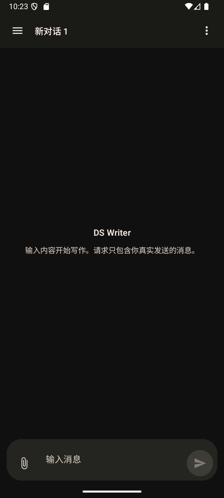
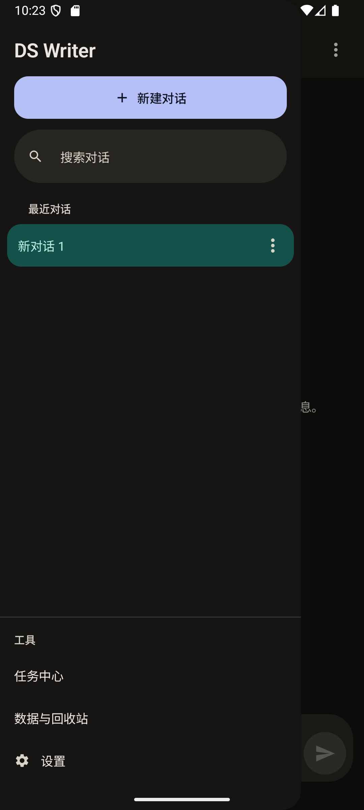
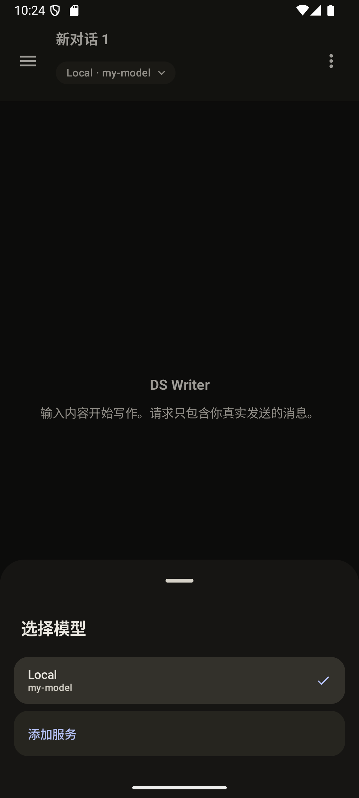
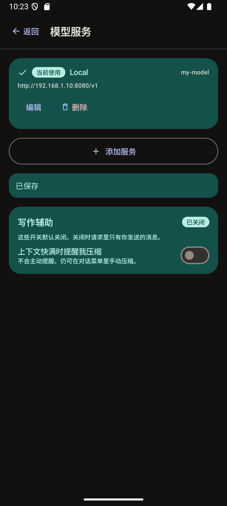
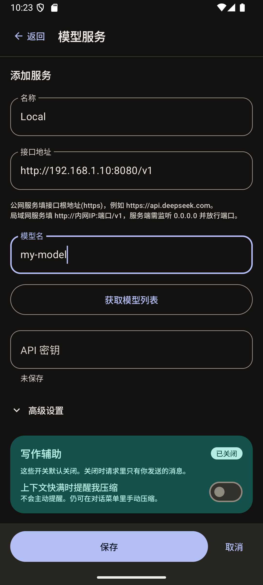
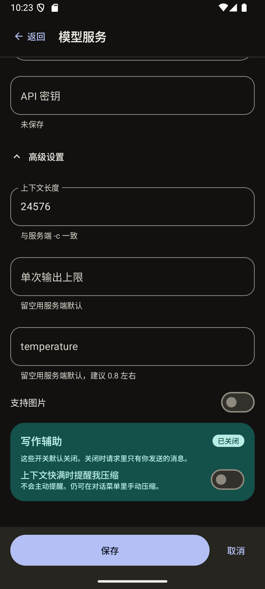

# DS Writer

**一个安卓上的 OpenAI 兼容对话客户端。装好之后没有任何接口地址、没有任何模型,代码里也不含任何厂商名字——你自己填一个,它就跟你指的地方说话,包括你自己电脑上跑的本地模型。**

[](https://github.com/wjy1603283179/DS-Writer-Android/releases/latest)
[](https://github.com/wjy1603283179/DS-Writer-Android/releases)
[](#%E4%B8%8B%E8%BD%BD%E5%AE%89%E8%A3%85)
[](LICENSE)

[下载安装](#下载安装) · [界面截图](#界面) · [本地模型怎么连](#连自己的本地模型) · [从源码构建](#从源码构建)
---

## 先说清楚这是什么

**开源出来玩玩的。** 自己写小说要用,顺手放出来,没有产品计划,也不打算跟谁竞争。

所以先说它**做不到**什么,免得你装了才发现:

- **不能**帮你管角色卡、世界书、大纲。它只有一个对话列表。
- **不能**自动帮你记住前面的剧情。上下文满了得你自己点一下压缩,压缩结果还要你自己过目确认。
- **没有**云同步、没有账号、没有会员。
- **没有**语义检索、没有文风学习、没有多智能体。
- **不会**自动应用更新。新版要你自己来下载安装。

它只做一件事:**把你打的消息原样发给模型,把模型说的话原样显示给你。**

听起来像废话,但市面上大部分客户端都往你的请求里偷偷加了东西——系统提示词、人设、记忆、工具描述。这个不加。你看到的输出,完全来自你发过去的正文。

---

## 界面

| 对话 | 侧边栏 | 选择模型 |
| --- | --- | --- |
|  |  |  |

| 模型服务 | 添加服务 | 高级设置 |
| --- | --- | --- |
|  |  |  |

---

## 能做什么

- **多个对话同时生成**,互不干扰,最多同时跑三个。
- **对话全部存在手机本地**,不上传任何地方。
- **可以存多个模型服务**,在聊天页顶部一键切换当前用哪个。
- **从服务器拉模型列表**:点一下"获取模型列表",它会读 `GET /models`,让你点选,不用猜服务端自己起的别名。
- **可以贴图片**(如果那个模型确实支持)。
- **长篇稿子压缩成前情提要**:结果先出现在一个可编辑的框里,你看过、改过、点了"用它开始新对话",它才会变成新对话里第一条真实的 `user` 消息。
- **导出**:对话可以导出成 Markdown 或 TXT。

---

## 下载安装

去 [Releases](https://github.com/wjy1603283179/DS-Writer-Android/releases/latest) 下载 APK。

| | |
| --- | --- |
| 系统要求 | Android 12 及以上 |
| 安装包大小 | 约 3.4 MB |
| 签名 | Android 调试证书 |

安装时系统会提示"来源未知",**这是正常的**:公开构建故意不使用任何个人发布密钥,所以它就是个用调试证书签名的包。介意的话可以照着[从源码构建](#从源码构建)自己编译自己签。

> 从 `0.9.0` 及更早的私有版本升上来的人注意:签名不一样,必须先卸载再装,数据会清空。

---

## 填接口地址

在设置里点"添加服务",填四样东西:名称、接口地址、模型名、API 密钥。

**接口地址**接受两种写法:

- 公网:`https://api.deepseek.com` 这样的 HTTPS 根地址 —— **公网必须 HTTPS**。
- 内网:`http://192.168.1.10:8080/v1` 这样的 —— 内网、回环、链路本地地址允许明文 HTTP。

除开头的四样,其余都在折叠的**高级设置**里(默认收起):

| 字段 | 说明 |
| --- | --- |
| 上下文长度 | 要和启动服务端时的 `-c` 一致。填大了请求可能超窗口,别虚报。 |
| 单次输出上限 | **留空 = 什么都不发**,用服务端自己的默认值。 |
| temperature | 同上,留空就不发。 |
| 支持图片 | 那个模型真的收图片才打开。 |

---

## 连自己的本地模型

DS Writer 就是个普通 HTTP 客户端,服务端只要满足三件事,**不需要任何插件、补丁或扩展**:

1. **提供 OpenAI 兼容接口。** 以 llama.cpp 为例,直接跑 `llama-server`,它本身就带 `/v1/models` 和 `/v1/chat/completions`。模型和运行时都不用改。
2. **监听别的设备能访问到的地址。** `--host 127.0.0.1` 只监听回环,手机无论如何都连不上。用 `--host 0.0.0.0`。同机自用两种写法都一样。
3. **放行端口。** 在专用网络配置里允许该端口入站。Windows 上网络配置文件也必须是"专用",因为"公用"默认拦截入站。

然后在手机设置里填 `http://你电脑的局域网IP:端口/v1`,点"获取模型列表",选一个,保存。

---

## 这个软件坚持的三件事

这几条是硬约束,不提供开关,改不了:

1. **永远不引入 `system` / `developer` 角色。** 有些服务端不接受这个角色,更重要的是——加了它,你的请求就不再是你写的东西了。
2. **永远不改写你打的字。** 不润色、不补全、不"帮你把话说清楚"。
3. **没有你的操作就不发请求。** 后台不会自己动。

完整声明见 [docs/PURE_CONVERSATION.md](docs/PURE_CONVERSATION.md)。

### 写作辅助是可选的

设置里有个**写作辅助**区,里面的开关**默认全部关闭**,每个开关都写明了"开着会怎样、关着会怎样"。全关的时候,请求里只有你打过的字——有测试专门盯着这个默认值,保证新装的应用不会偷偷改变行为。

| 开关 | 关(默认) | 开 |
| --- | --- | --- |
| 上下文快满时提醒我压缩 | 不提醒,也不压缩。对话菜单里仍可手动压缩。 | 快满时在聊天页弹一张醒目的卡片,提供压缩入口。**它自己不会发任何东西。** |

---

## 不会有的东西

**故意没有应用内更新。** 没有更新客户端、没有更新地址、没有 `REQUEST_INSTALL_PACKAGES` 权限、没有 APK 的 `FileProvider`。装新版就是手动装。

这样做的原因:应用除了你配置的那个接口地址之外,连不上任何人的服务器;别人 fork 这个项目也不会继承任何原有基础设施。有一条仪器测试专门断言这个权限和这个 Provider 不存在。

---

## 从源码构建

需要 AGP 8.13.2、Gradle 8.14.3、Kotlin 2.3.21、KSP 2.3.11、JDK 17(或兼容的更新版本)、Android SDK 35、Build Tools 35.0.0。

```powershell
.\gradlew.bat testDebugUnitTest
.\gradlew.bat lintDebug
.\gradlew.bat assembleDebug
```

有 API 35 模拟器时,还可以跑 `.\gradlew.bat connectedDebugAndroidTest`。调试包输出在 `app/build/outputs/apk/debug/app-debug.apk`。

### 签名发布

仓库里**永远不放签名材料**,也**不会用别人的密钥签名**。只有当你自己提供了 `~/.gradle/dswriter-release/signing.properties` 且没有显式关闭时,Gradle 才会用本地签名。任何机器上都能构建一个未签名的 release:

```powershell
.\gradlew.bat assembleRelease -PdsWriterSigning=off
```

输出 `app/build/outputs/apk/release/app-release-unsigned.apk`。未签名的 APK 装不上,要用 `apksigner` 和你自己的密钥签。

想自动签名,就按 `storeFile`、`storePassword`、`keyAlias`、`keyPassword`、`storeType` 建那个 properties 文件,放在仓库外面(`.gitignore` 已经排除了它)。

自己发版时保持同一个 `applicationId` 和同一把签名密钥,并递增 `versionCode`——Android 只在身份和签名链一致时才允许覆盖安装。密钥务必离线备份:丢了的话用户必须先卸载才能装你的下一个版本。

release 重新构建**不是字节可复现的**,所以要归档带版本号的 APK,并从那份副本记录摘要,而不是从构建输出目录取——那个目录会被下一次构建覆盖。

---

## 安全与隐私

- API 密钥用 Android Keystore 加密,不进导出文件,不存 Room,不写资源,不进请求快照,不进日志。
- Android 平台备份和设备迁移已关闭。
- 可读导出只包含对话标题和实际可见的用户/助手消息正文;不含推理过程、凭据、附件路径和运行时元数据。
- 没有账号系统,没有统计上报,没有崩溃上报。

---

## 许可证

MIT,见 [LICENSE](LICENSE)。
